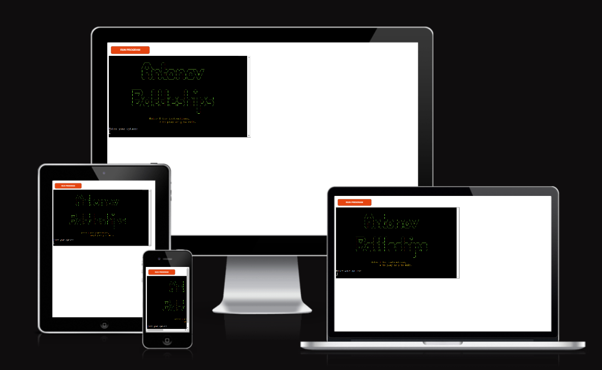
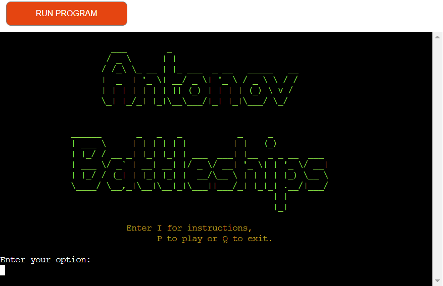

# Antonov Battleships

The site is now deployed [here](https://rfow-antonov-battleship-game-ecd25dcecf29.herokuapp.com/)

## How To Play

Antonov Battleships is game played between you and the computer. You can play with any size board from 5 by 5 to 8 by 8. The number ships the board has varies from 5 to 12 depending on the size of board.

## Features

### Existing Features

### Future Features

## Data Model

## Testing

### Bugs

#### Solved Bugs

### Remaining Bugs

### Validator Testing

The pep8 validator[pep8](https://pep8ci.herokuapp.com/)

## Deployment

The game was deployed to Heroku as follows

- Login to your Heroku account
- Click on create new app
- Enter the app name in the \'App Name\'
- Click on Choose a region and select Europe
- Click on \'Settings\'
- In the Config Vars create a _Config Var_ called PORT and set this value to 8000
- In the build pack section add Python and then Nodejs
- Click on Deploy
- In the deployment method section click on Connect to Github
- Click on the Connect to Github button to confirm
- In the search for repository enter the \'antonov-battleship-game\' and click on search
- In the earch field on the repository and click on connect
- In the automatic deploy section click on \'Enable Automatic Deploys\' button
- The game is now is now deployed to Heroku

The link to deployed app is [here](https://rfow-antonov-battleship-game-ecd25dcecf29.herokuapp.com/)

## Credits

### Resources

This resource was useful
[The Battlesip Game](https://en.wikipedia.org/wiki/Battleship_(game))

Use of ASCII control code such as CSI and SGR 
[ANSI escape code](https://en.wikipedia.org/wiki/ANSI_escape_code)

Corey's Tutorial on \'if __name__ == \'__main__\'\' 
[Python Tutorial: if __name__ == '__main__'](https://www.youtube.com/watch?v=sugvnHA7ElY)

This was also useful
[Python OOP Tutorial](https://www.youtube.com/watch?v=ZDa-Z5JzLYM)
