# Antonov Battleships

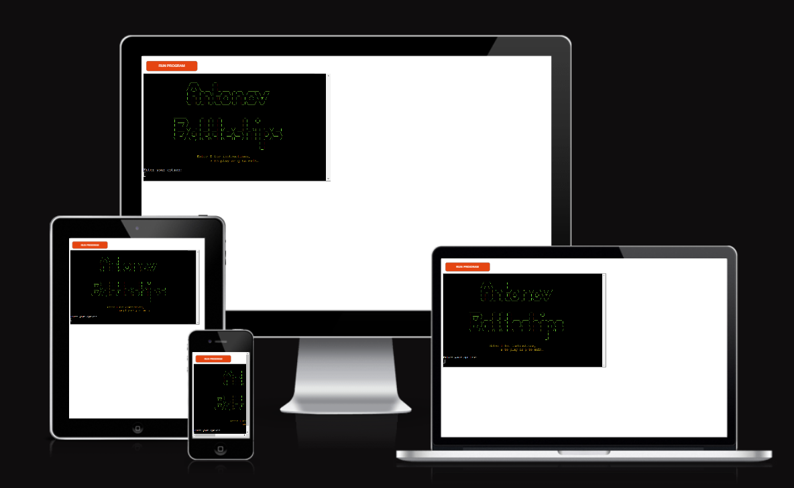

The site is deployed [here](https://rfow-antonov-battleship-game-ecd25dcecf29.herokuapp.com/)

## About Antonov Battleships

Antonov Battleships is a single player game played between you, the user, and the computer. The objective is to sink all of the computer\'s ships first before the computer sinks all of yours. You can choose to play with any size board from 5 by 5 to 8 by 8. The number ships the board has varies from 5, 7, 9 and 12 ships depending on the size of board. All the ships are placed at random on the board.

The game is aimed at users who have some spare time and want to while away their time.

## How to play

The game is started by selecting play from the title screen.

### Board size selection

The first thing the game asks you to do is to select the board size as shown. Each size comes with a determined number of ships to play with.

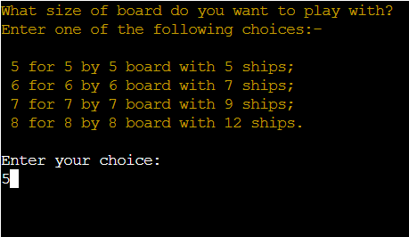

### Name input

The second thing the game asks for is your name.

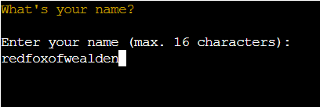

### Opening game

The game opens up with this display as shown

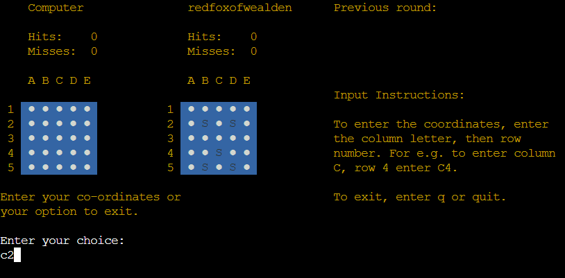

It displays two boards and an information panel on the right.

The first board shows the computer. Every position is marked with a dot and __no__ ships are revealed.

The second board, your board, shows the position of the ships and the rest of positions are marked with a dot.

The ships on both boards are placed at random.

On each board the rows are labeled by numbers and column by letters. You enter your guess of where you think one of the computer ships is. You enter the coordinates using the column row format: for example to enter column C row 2 you enter c2 as shown above.

The information panel on the right shows the outcome from the previous round. Below that the input instructions to remind you how to input coordinates.

### Play

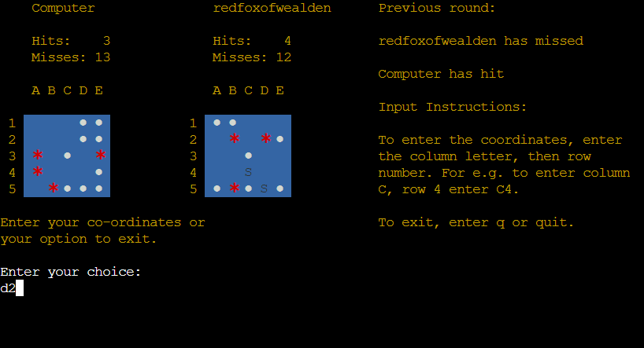

You and the computer take turns at playing the game.

If the coordinates that you\'ve input results in a miss a blank space appears. If it results in a hit a red asterisk sppears as shown above. Your and the computer\'s scores are updated for each round. If you or the computer missed, the \'Misses\' score is updated. If you or the computer hits a ship, the \'Hits\' score is updated.

The panel on the right show what happened during previous round: whether you and the computer had missed or hit a ship.

### End Game

When you won, that is the computer has all its ships, the game ends with this message as shown below.

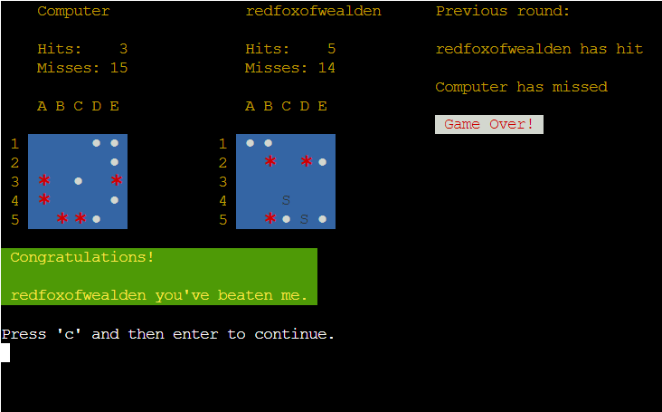

If you lose all your ships the game ends with the message shown below.

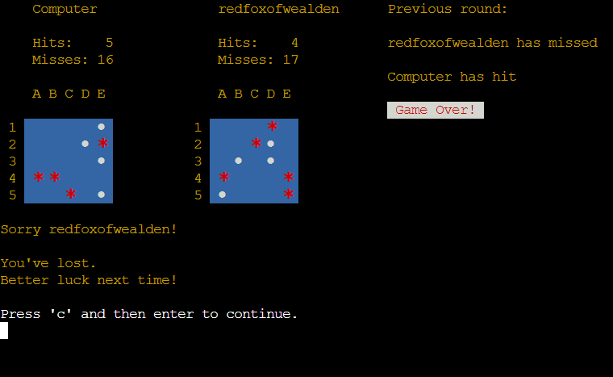

## Features

### Existing Features

#### Opening title and options

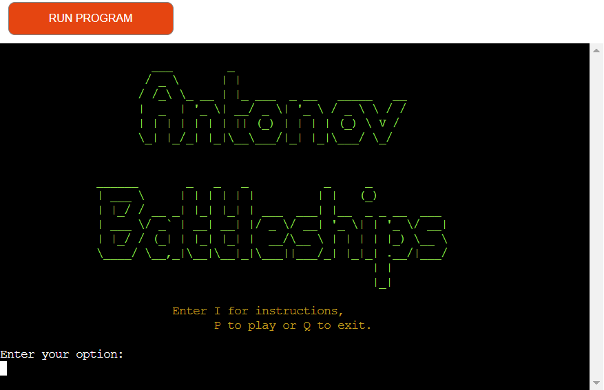

The image above features an opening title displayed in light green color. The options below are displayed in yellow.

#### The game

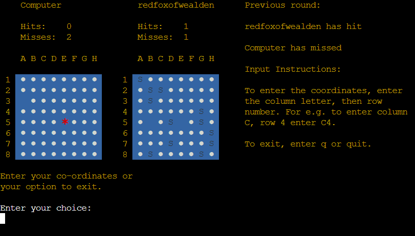

##### Board

Each board has player's or computer name, score board showing both hits and misses and the game board. The game board's column are headed letters and rows by numbers.
The background of the board is blue to distinguish the position of pieces.
See image above.

##### Information panel

The information panel display on the right of the two boards displays what happened during the previous round. Underneath the input instructions are displayed. At the end of the game, a game over message is displayed.
See image above.

#### Input validation

The game validates an incorrect input with a message as shown below. An invalid message is displayed with white text on red background.

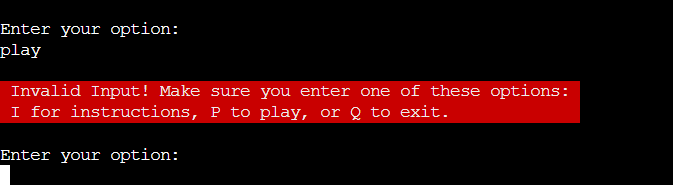

If the user input coordinates already inputed this message below is displayed. As it is a warning message, the text is displayed with black text on a white background.

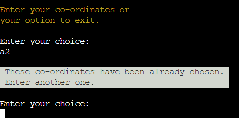

#### Coordinate input system

The coordinate system used in the game is the column, represented by letters, and row, represented by numbers. The user inputs the coordinate using the column row format: for example if the user wanted to input column C, row 4 then the user inputs C4. If the two are transposed it will be classed as an invalid input.

#### Instructions

The game has instructions that the player can view before playing the game. It is displayed over 2 screens. The first part is shown below.

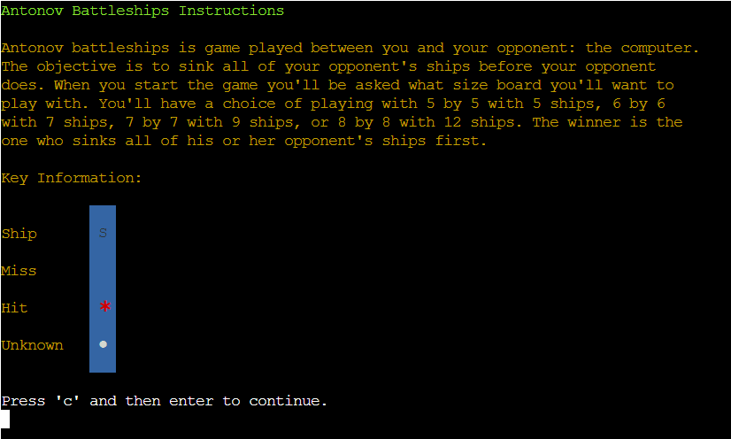

And the 2nd part is here below.

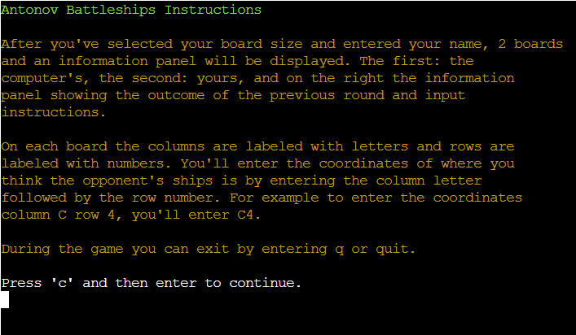

## Data Model

The Human and Computer classes are used to represent the human and computer respectively. Both are derived from the Board class.

The Board class stores the position of the ships, hits and misses. It also stores whether to reveal the ships\' position. It also stores the scores: both hits and misses. And it also stores previous chosen coordinates from both derived classes. However the class does __not__ disguish between human and computer.

The difference between the computer and human classes is the way coordinates are generated and inputed. The human class asks you to input the coordinates and the computer class generates them at random.

## Testing

Testing the app was done on codeanywhere, on the deployed site at Heroku and by running the code through the PEP8 linter: [Code Institute Python Linter](https://pep8ci.herokuapp.com/).

### Bugs

#### Spelling mistakes in identifiers

Most of the bugs encountered were due to spelling mistakes in identifiers. These were corrected as soon as they were identified.

#### Invalid comparison

This was the most baffaling. During the test to parse input to process co-ordinates, this code always evaluated to false.

```py
...

elif len(choice) == 2:
    parse_status = self._parse_input(choice)

...
```

To fix this the code was changed from the literal \'2\' to \'int(2)\' as below.

```py
...

elif len(choice == int(2):
    parse_status = self._parse_input(choice)

...
```

#### Error detected during linting

This error was detected during linting.

```py
if self._check_coord_picked(row, column) == False:
    list_coord = [row, column]
    self.previous_chosen_coord.append(list_coord)
    break
```

To pass the lint test the code was changed to this shown below.

```py
if self._check_coord_picked(row, column) is False:
    list_coord = [row, column]
    self.previous_chosen_coord.append(list_coord)
    break
```

#### Color reproduction

During testing on codeanywhere the colours were not not reproduced accurately. To test whether the colors displayed correctly the code had to be deployed to github and then to Heroku.

On the first test of the app on Heroku the background and foreground colors was preselected and then clear screen command was sent. This resulted in the corruption of the background color. Instead of it being black displayed a grey background. The result was to rethink how colors should be applied in the app. The result was a redesign of how the app applied the colors. The result was to use the system default background color and only the background color where it was needed.

### Remaining Bugs

There are no known bugs remaining.

### Validator Testing

The pep8 validator used was the [Code Institute Python Linter](https://pep8ci.herokuapp.com/). It was used frequently during code refactoring. All errors and warnings were addresses until the linter gave out no error or warnings.

## Deployment

The game was deployed to Heroku as follows

- Login to your Heroku account
- Click on create new app
- Enter the app name in the \'App Name\'
- Click on Choose a region and select Europe
- Click on \'Settings\'
- In the Config Vars create a _Config Var_ called PORT and set this value to 8000
- In the build pack section add Python and then Nodejs
- Click on Deploy
- In the deployment method section click on Connect to Github
- Click on the Connect to Github button to confirm
- In the search for repository enter the \'antonov-battleship-game\' and click on search
- In the earch field on the repository and click on connect
- In the automatic deploy section click on \'Enable Automatic Deploys\' button
- The game is now is now deployed to Heroku

The link to deployed app is [here](https://rfow-antonov-battleship-game-ecd25dcecf29.herokuapp.com/)

## Credits

I'd like to thank my mentor for providing excellent guidance and advice.

### Resources

Use of ASCII escape control code in classes CSI and SGR was taken from [ANSI escape codes](https://en.wikipedia.org/wiki/ANSI_escape_code)

The use of clearing screen and positioning the cursor using control codes was taken from [CSI (Control Sequence Introducer) sequences](https://en.wikipedia.org/wiki/ANSI_escape_code#CSI_(Control_Sequence_Introducer)_sequences) on Wikipedia.

The use of color control codes used in the SGR class was taken from [SGR (Select Graphic Rendition) parameters](https://en.wikipedia.org/wiki/ANSI_escape_code#SGR_(Select_Graphic_Rendition)_parameters) on Wikipedia.

The ASCII generator was used to create the title of the game - [ASCII Generator](http://www.network-science.de/ascii/)

This resource was useful to aid my understanding on the use of control characters to position cursors, clear screens and color foreground and background [Build your own Command Line with ANSI escape codes](https://www.lihaoyi.com/post/BuildyourownCommandLinewithANSIescapecodes.html).

Corey's Tutorial on \'if __name__ == \'__main__\'\'
[Python Tutorial: if __name__ == '__main__'](https://www.youtube.com/watch?v=sugvnHA7ElY)

This was also useful to aid my understanding of classes and property in python
[Python OOP Tutorial](https://www.youtube.com/watch?v=ZDa-Z5JzLYM)

This resource was useful to understand the original Battleship game on [The Battleship Game](https://en.wikipedia.org/wiki/Battleship_(game)) on Wikipedia.
