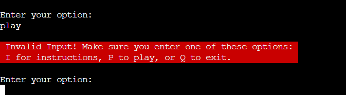
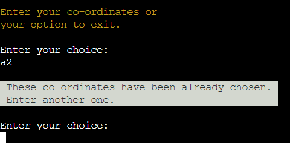

# Antonov Battleships

The site is deployed [here](https://rfow-antonov-battleship-game-ecd25dcecf29.herokuapp.com/)

## How To Play

Antonov Battleships is game played between you and the computer. You can play with any size board from 5 by 5 to 8 by 8. The number ships the board has varies from 5 to 12 depending on the size of board.

When the user chooses to play game the app presents 4 options with different size boards with a number of ships. Then the app asks for the name and starts the game. Two boards are presented with the ships placed at random.

## Features

### Existing Features

The app features title with options, instructions and the game.
The app starts with the opening title as shown above.

#### Input validation

The app validates with an incorrect input as shown below

#### Warning

## Concept

The title for the game was chosen arbitrarily. The app uses object orientated design.

## Testing

### Bugs

### Solved Bugs

### Remaining Bugs

There are no known bugs remaining.

### Validator Testing

The pep8 validator used was the [CI Python Linter](https://pep8ci.herokuapp.com/). It was used frequently during code refactoring.

## Deployment

The game was deployed to Heroku as follows

- Login to your Heroku account
- Click on create new app
- Enter the app name in the \'App Name\'
- Click on Choose a region and select Europe
- Click on \'Settings\'
- In the Config Vars create a _Config Var_ called PORT and set this value to 8000
- In the build pack section add Python and then Nodejs
- Click on Deploy
- In the deployment method section click on Connect to Github
- Click on the Connect to Github button to confirm
- In the search for repository enter the \'antonov-battleship-game\' and click on search
- In the earch field on the repository and click on connect
- In the automatic deploy section click on \'Enable Automatic Deploys\' button
- The game is now is now deployed to Heroku

The link to deployed app is [here](https://rfow-antonov-battleship-game-ecd25dcecf29.herokuapp.com/)

## Credits

### Resources

This resource was useful to understand the original Battleship game on [The Battleship Game](https://en.wikipedia.org/wiki/Battleship_(game)) on Wikipedia.

Use of ASCII control code in classes CSI and SGR was taken from [ANSI escape code](https://en.wikipedia.org/wiki/ANSI_escape_code)

The use of clearing screen and positioning the cursor using control codes was taken from [CSI (Control Sequence Introducer) sequences](https://en.wikipedia.org/wiki/ANSI_escape_code#CSI_(Control_Sequence_Introducer)_sequences) on Wikipedia.

The use of color control codes used in the SGR class was taken from [SGR (Select Graphic Rendition) parameters](https://en.wikipedia.org/wiki/ANSI_escape_code#SGR_(Select_Graphic_Rendition)_parameters) on Wikipedia.

This resource was useful to aid my understanding on the use of control characters to position cursors, clear screens and color foreground and background [Build your own Command Line with ANSI escape codes](https://www.lihaoyi.com/post/BuildyourownCommandLinewithANSIescapecodes.html).

Corey's Tutorial on \'if __name__ == \'__main__\'\' 
[Python Tutorial: if __name__ == '__main__'](https://www.youtube.com/watch?v=sugvnHA7ElY)

This was also useful to aid my understanding of classes and property in python
[Python OOP Tutorial](https://www.youtube.com/watch?v=ZDa-Z5JzLYM)
